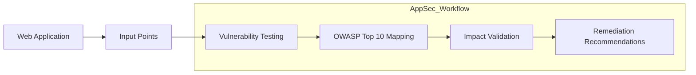

```mermaid
flowchart LR
    A["Web Application"] --> B["Input Points"]
    B --> C["Vulnerability Testing"]
    C --> D["OWASP Top 10 Mapping"]
    D --> E["Impact Validation"]
    E --> F["Remediation Recommendations"]

    subgraph AppSec_Workflow
        C
        D
        E
        F
    end
```
